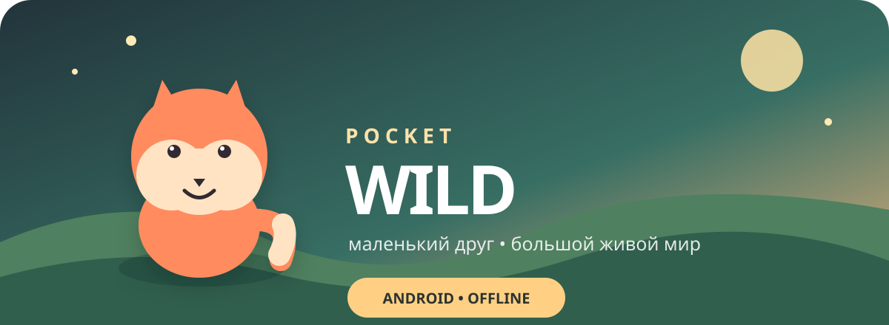

<div align="center">
  
  <p><strong>Уютная Android-игра о питомце, который растёт и исследует мир вместе с вами.</strong></p>
  <p><a href="https://github.com/Doloreshazze/PocketWild/actions/workflows/android.yml"></a></p>
</div>

## Что уже можно делать

- выбрать лисёнка, аксолотля или совёнка и дать ему имя;
- кормить, играть, умывать и укладывать питомца спать;
- видеть отдельные милые анимации кормления, игры, купания и сна;
- слышать уникальный процедурный голос каждого вида питомца;
- укреплять уровень дружбы заботой и совместными играми;
- формировать живой характер питомца: озорной, ласковый, любопытный или гармоничный;
- замечать эмоции по мимике, репликам и милым визуальным эффектам;
- гладить питомца касанием и получать личную реакцию на его характер;
- играть в «Ягодный дождь»: вести питомца пальцем и ловить обычные и золотые ягоды;
- получать опыт, повышать уровень и собирать ягодную валюту;
- выполнять ежедневное приключение;
- открывать сад, светящийся лес и лунный берег;
- продолжать игру после перезапуска — прогресс сохраняется локально;
- играть без интернета, аккаунта и сервера.

PocketWild использует мягкую модель заботы: питомец никогда не умирает и не исчезает. После долгого перерыва он просто соскучится.

## Почему это «тамагочи на максималках»

Главная идея — превратить обычные шкалы голода и радости в совместное путешествие. Характер питомца не выбирается готовой наклейкой: он постепенно складывается из того, как семья играет, заботится и исследует мир. Эмоции временные, читаемые и никогда не используются для наказания игрока.

Текущая версия — играбельный вертикальный срез. В ней уже есть цикл «забота и мини-игры → дружба и опыт → уровень → новое место».

## Запуск

1. Откройте проект в Android Studio Otter 3 или новее.
2. Дождитесь Gradle Sync.
3. Запустите конфигурацию `app` на устройстве или эмуляторе с Android 7.0+.

Либо из терминала:

```bash
./gradlew assembleDebug
```

APK появится в `app/build/outputs/apk/debug/`.

## Технологии

- Kotlin
- Jetpack Compose + Material 3
- локальное сохранение через `SharedPreferences`
- процедурная анимация на Compose Canvas и офлайн-синтез голосов через `AudioTrack`
- чистая игровая логика в `GameEngine`, покрытая unit-тестами
- minSdk 24, targetSdk 36

## Ближайшее развитие

- взросление питомца и визуальные формы;
- три мини-игры для разных характеров;
- коллекция найденных предметов и воспоминаний;
- короткие сюжетные события в локациях;
- украшение дома без pay-to-win;
- локальные уведомления с бережной частотой;
- подготовка локализаций для Google Play.

## Лицензия

MIT — см. [LICENSE](LICENSE).
